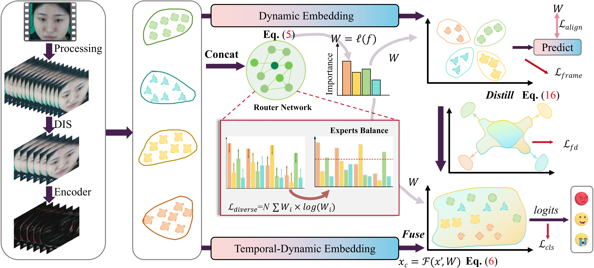

<div align="center">

# DisMoE: Can Distillation-Driven Frame-Level Mixture-of-Experts Enable Robust Micro-Expression Recognition?

[]()
[]()
[]()
[]()

**Official implementation of the ICME 2026 paper**
</div>

---

## 📰 News

- **[2026]** 🎉 Our paper **“DisMoE: Can Distillation-Driven Frame-Level Mixture-of-Experts Enable Robust Micro-Expression Recognition?”** is accepted by **ICME 2026**.
- **[2026]** 📢 The source code is publicly available in this repository.

---

## ✨ Highlights

- ✅ **Apex-free MER framework**
- ✅ **Dynamic temporal subsequence sampling**
- ✅ **Frame-level mixture-of-experts design**
- ✅ **Knowledge distillation across frames**
- ✅ **Strong generalization across multiple benchmark datasets**

---

## 🧠 Abstract

> Micro-expression recognition (MER) aims to detect genuine emotions through subtle and transient facial movements. However, existing methods depend on apex annotations and precise prior knowledge, while failing to capture comprehensive temporal dynamics. To overcome these limitations, we propose a **Distillation-Driven Mixture of Frame-Level Experts (DisMoE)** framework, in which a **Dynamic Interval Sampling (DIS)** strategy is introduced to adaptively select temporal subsequences, thereby eliminating reliance on apex annotations and enhancing temporal robustness. A **Continuous Attention (CA)** block further refines emotion-relevant spatial cues and facilitates the modeling of temporal features. In parallel, the **Mixture-of-Experts (MoE)** dynamically fuses motion cues from multiple frame-level experts via a router network, while a **Frame-level Distillation (FD)** mechanism transfers complementary knowledge across frames to reinforce temporal coherence and discriminability. Extensive experiments on four benchmark datasets (**CASME II, SAMM, SMIC-HS, and CAS(ME)$^3$**) demonstrate that DisMoE consistently outperforms state-of-the-art methods in both accuracy and robustness.

---

## 🏗️ Framework

<div align="center">
  
</div>

**Pipeline of DisMoE.**  
The framework consists of four main components:

1. **Dynamic Interval Sampling (DIS)** for adaptive temporal subsequence selection;  
2. **Continuous Attention (CA)** for refining subtle facial motion cues;  
3. **Mixture-of-Experts (MoE)** for dynamic fusion of frame-level motion representations;  
4. **Frame-level Distillation (FD)** for transferring complementary information across frames.  


---

## 📂 Repository Structure

```text
DisMoE/
├── assets/                  # Figures for README
├── configs/                 # Training and evaluation configs
├── datasets/                # Dataset preprocessing scripts / file lists
├── models/                  # Network definitions
├── losses/                  # Loss functions
├── utils/                   # Utility functions
├── train.py                 # Training script
├── test.py                  # Evaluation script
├── requirements.txt         # Python dependencies
└── README.md
